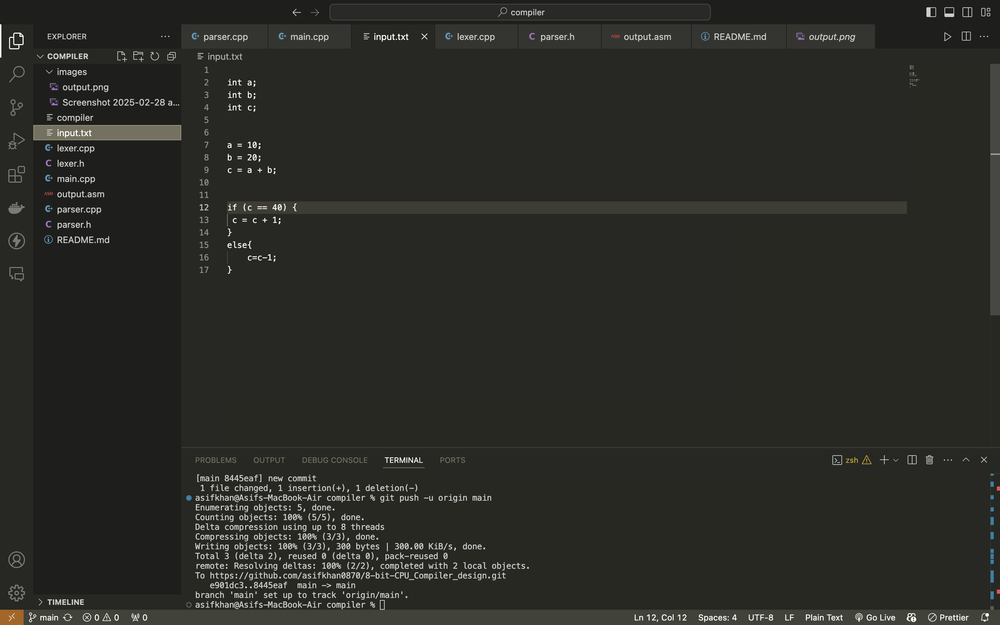

# Simplelang compiler

features

* identifications of tokens
* variable declaration
* Assignment to the varialbe
* can done Arithmetic operation like plus minus etc..
* Conditionals expression handle if and else 

# How to Run this compiler ( How to use it )

 first step run this 
```
     g++ -o compiler main.cpp lexer.cpp parser.cpp

```

second step run this

```
  ./compiler

```

# How to use output file 

When you run then it will generate the assmebly code of you input.txt file text 


input text file 



output file


# Where have to paste the assemply code 

step 1 : clone the this git repo 
   
   ```
        https://github.com/lightcode/8bit-computer
   ```


step 2: go to folder   ( cd 8bit-computer)

step 3: make a file example.asm or any other name and paste the assembly code generated by  compiler  output.asm  paste it into create d file


```
    python3 ./asm/asm.py tests/example.asm > memory.list
```    


step 4:  

```
  make clean && make run 

```

* your final output looks like this 


# structure of compiler   

 

 

 

 
 


